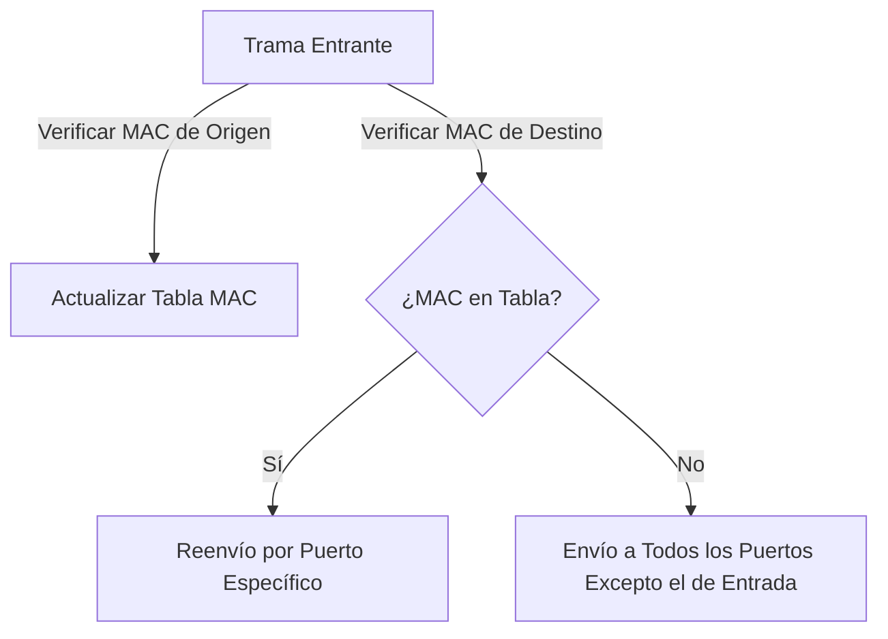
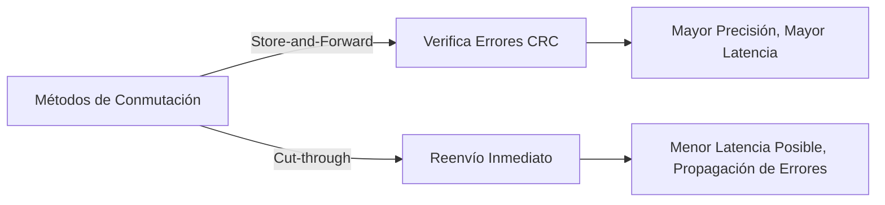
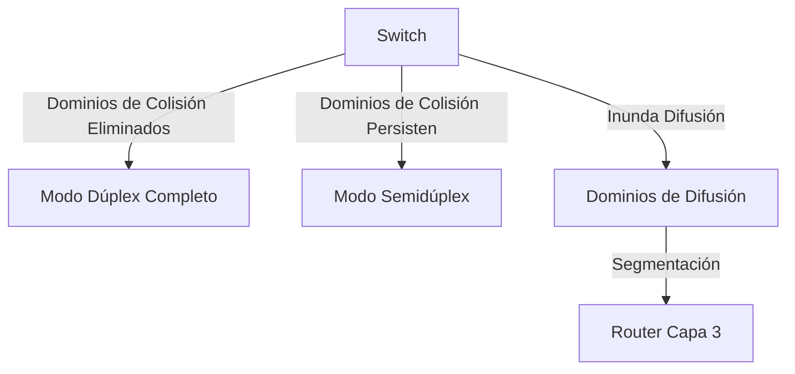
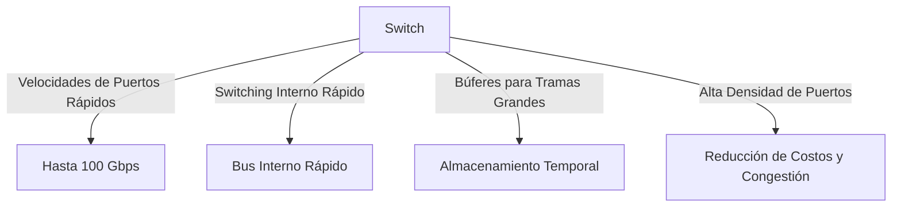

# SEMANA 2 - Conceptos de Conmutación (Switching)

1. **Reenvío de Tramas (Frame Forwarding)**
    - Conmutación en Redes: El switch utiliza las direcciones MAC para decidir cómo reenviar las tramas. Existen dos términos clave:
        - **Entrada**: Trama que ingresa al switch a través de una interfaz.
        - **Salida**: Trama que sale del switch a través de una interfaz.
    
    - Tabla de Direcciones MAC:
        Los switches mantienen una tabla de direcciones MAC (también conocida como tabla CAM) que asocia las direcciones MAC con los puertos del switch. Esta tabla es fundamental para el proceso de conmutación de tramas.

    - Proceso de Aprendizaje:
        Cuando un switch recibe una trama, aprende la dirección MAC de origen y el puerto por donde ingresó.

    - Reenvío de Tramas:
        - Si la dirección MAC de destino está en la tabla, la trama se reenvía al puerto correspondiente.
        - Si no está en la tabla, la trama se envía a todos los puertos excepto el de entrada (flooding).

2. **Métodos de Reenvío de un Switch**
    - **Conmutación de Almacenamiento y Reenvío (Store-and-Forward)**:
        - El switch recibe la trama completa antes de reenviarla.
        - Verifica errores CRC en la secuencia de comprobación de tramas (FCS).
        - **Ventaja**: Mayor precisión al eliminar tramas dañadas.
        - **Desventaja**: Mayor latencia comparada con otros métodos.

    - **Conmutación de Corte (Cut-through Switching)**:
        - Reenvía la trama tan pronto como se lee la dirección MAC de destino.
        - No verifica errores CRC, lo que puede propagar errores.
        - **Ventaja**: Baja latencia, ideal para aplicaciones sensibles al tiempo.
        - **Desventaja**: Puede generar problemas de ancho de banda y propagar tramas corruptas.

3. **Dominios de Switching**
    - **Dominios de Colisión**:
        Se producen en segmentos de red donde dos o más dispositivos compiten por el mismo ancho de banda.
        Los switches eliminan los dominios de colisión al operar en modo dúplex completo. Sin embargo, si hay dispositivos en modo semidúplex, los dominios de colisión persisten.

    - **Dominios de Difusión (Broadcast Domains)**:
        Un dominio de difusión abarca todos los dispositivos conectados a una LAN de Capa 2. Un switch inundará todas las interfaces con una trama de difusión excepto la interfaz de entrada.
        Los dominios de difusión solo se pueden segmentar con dispositivos de Capa 3 (routers).

4. **Técnicas de Mejora del Rendimiento de Red**
    - **Alivio de la Congestión en la Red**:
        - **Velocidades de Puertos Rápidos**: Los switches pueden soportar velocidades de puerto de hasta 100 Gbps.
        - **Switching Interno Rápido**: Uso de bus interno rápido o memoria compartida para mejorar el rendimiento.
        - **Búferes para Tramas Grandes**: Permiten el almacenamiento temporal de tramas para manejar grandes cantidades de tráfico.
        - **Alta Densidad de Puertos**: Proporciona conectividad para múltiples dispositivos en una LAN, reduciendo la congestión y costos.

### Conclusión
Este documento cubre los conceptos esenciales de la conmutación en redes, incluyendo cómo funcionan los switches a nivel de Capa 2, los métodos de conmutación, los dominios de colisión y difusión, y las técnicas para mejorar el rendimiento de la red. Proporciona una base sólida para responder a las preguntas de retroalimentación de manera efectiva y precisa.
