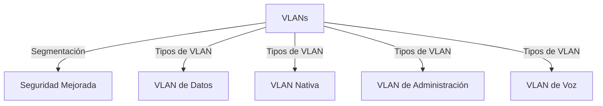
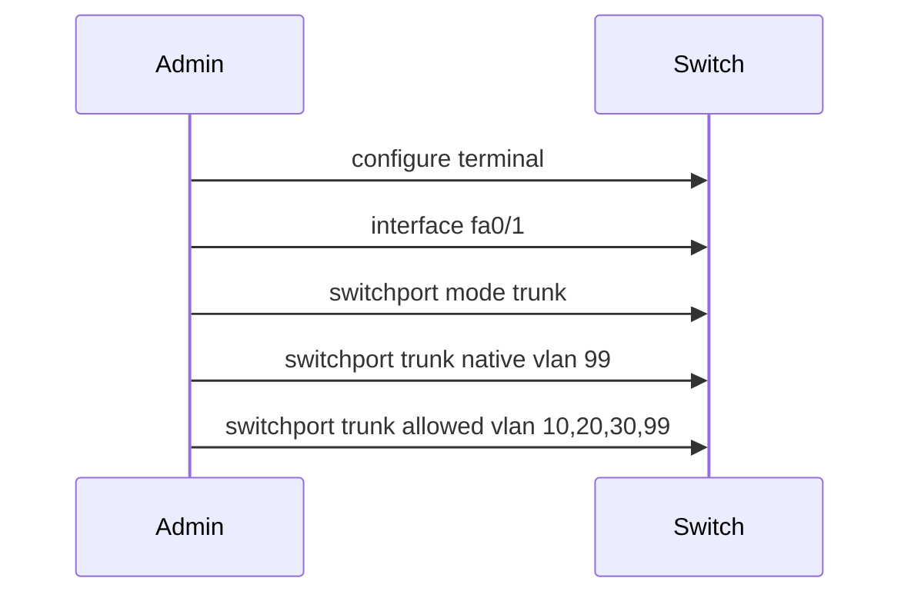
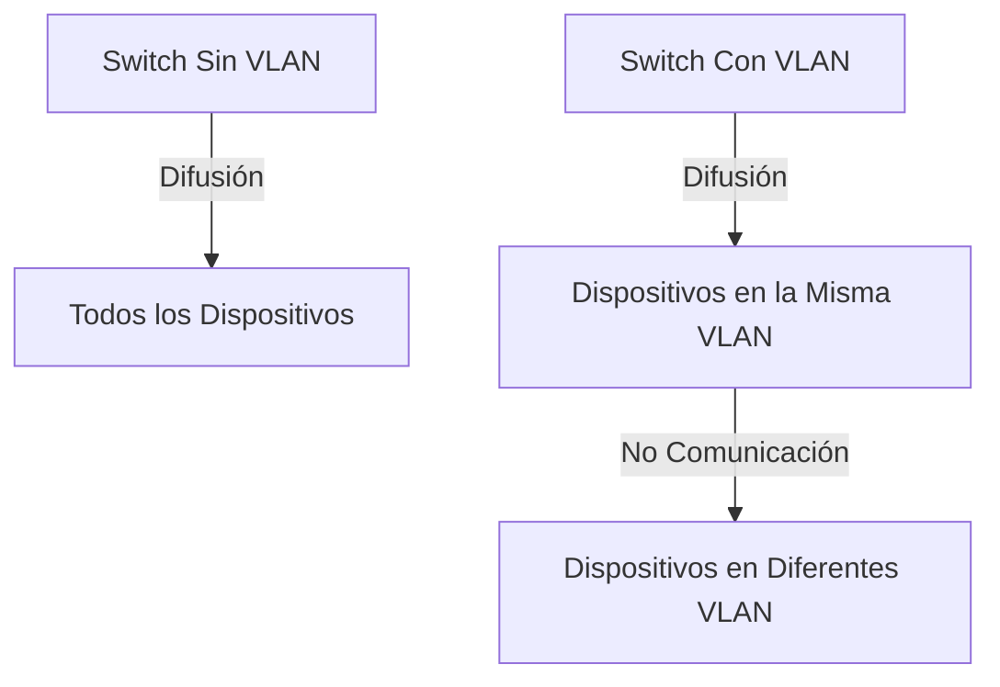
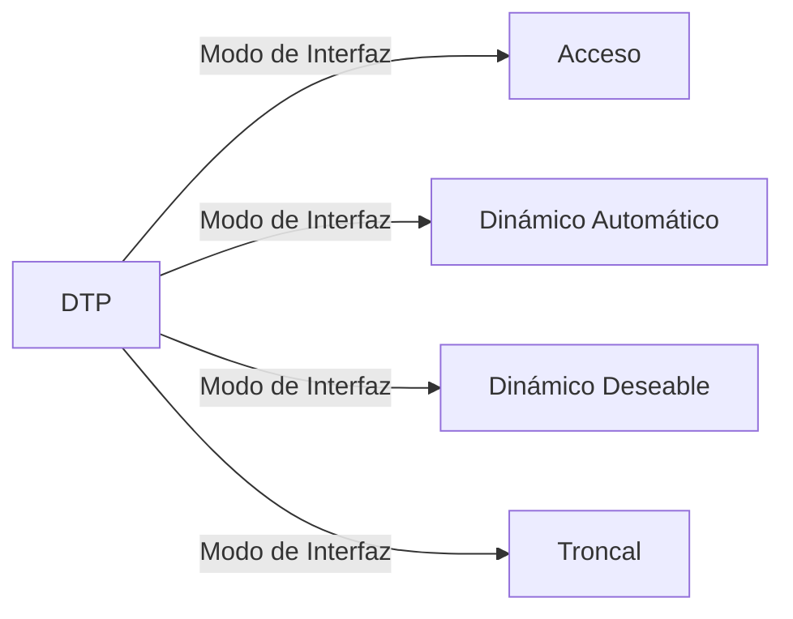

# SEMANA 3 - VLANs

1. **Descripción General de las VLAN**
    - **Definiciones de VLAN**: Las VLAN (Virtual LANs) son conexiones lógicas que agrupan dispositivos en una red conmutada, proporcionando segmentación de red, mejor seguridad y administración más eficiente. Permiten que los dispositivos en diferentes VLAN no puedan comunicarse entre sí a menos que un dispositivo de capa 3, como un router, esté configurado para permitir esa comunicación.

    - **Características Clave de las VLAN**:
        - **Segmentación de la Red**: Divide la red en dominios de difusión más pequeños, reduciendo la congestión.
        - **Seguridad**: Solo los dispositivos en la misma VLAN pueden comunicarse directamente.
        - **Eficiencia**: Los grupos con necesidades similares pueden agruparse, mejorando la gestión de red.
        - **Reducción de Costos**: Un switch puede soportar múltiples VLAN, reduciendo la necesidad de hardware adicional.

    - **Tipos de VLAN**:
        - **VLAN de Datos**: Tráfico generado por usuarios, como correos electrónicos o tráfico web.
        - **VLAN Nativa**: Utilizada para enlaces troncales. Las tramas en esta VLAN no están etiquetadas por el estándar 802.1Q.
        - **VLAN de Administración**: Para tráfico de administración (SSH/Telnet). Es la interfaz virtual de administración (SVI) del switch.
        - **VLAN de Voz**: Necesaria para soportar VoIP; garantiza ancho de banda, baja latencia y alta prioridad QoS.

2. **VLAN en un Entorno de Conmutación Múltiple**
    - **Definición de Enlaces Troncales**:
        Los enlaces troncales permiten que múltiples VLAN pasen a través de un único enlace físico entre switches. Usan etiquetado IEEE 802.1Q para identificar el tráfico de VLAN.

    - **Configuración de Enlaces Troncales**:
        - Configurar el puerto como troncal (`switchport mode trunk`).
        - Especificar VLAN nativa para tráfico no etiquetado (`switchport trunk native vlan`).
        - Permitir el paso de VLAN específicas (`switchport trunk allowed vlan`).

    - **Redes con y sin VLAN**:
        - **Sin VLAN**: Todo el tráfico de unidifusión, multidifusión y difusión es enviado a todos los dispositivos conectados al switch.
        - **Con VLAN**: El tráfico de unidifusión, multidifusión y difusión se limita a una VLAN específica. Sin un dispositivo de Capa 3, los dispositivos en diferentes VLAN no pueden comunicarse.

3. **Protocolo de Enlace Troncal Dinámico (DTP)**
    - **DTP (Dynamic Trunking Protocol)**: Es un protocolo propietario de Cisco que gestiona la negociación de enlaces troncales. Está activado de forma predeterminada en algunos switches Cisco y puede ser desactivado usando el comando `switchport nonegotiate`.

    - **Modos de Operación de DTP**:
        - **Acceso**: Fuerza la interfaz a ser un puerto de acceso.
        - **Dinámico Automático**: Se convierte en troncal si la interfaz vecina está configurada como troncal o deseable.
        - **Dinámico Deseable**: Intenta activamente negociar para convertirse en un troncal.
        - **Troncal**: Fuerza la interfaz a ser un puerto troncal.

4. **Configuración y Verificación de VLAN**
    - **Creación de VLAN**:
        Se realiza en el modo de configuración global usando los comandos:
        - `vlan vlan-id`: Crea una VLAN con el ID especificado.
        - `name vlan-name`: Asigna un nombre a la VLAN.
        Los detalles de las VLAN se almacenan en el archivo `vlan.dat` en la memoria flash.

    - **Asignación de Puertos a VLAN**:
        Una vez creada la VLAN, los puertos pueden asignarse a ella:
        - `interface interface-id`: Ingresa al modo de configuración de la interfaz.
        - `switchport mode access`: Establece el puerto en modo de acceso.
        - `switchport access vlan vlan-id`: Asigna el puerto a la VLAN especificada.

    - **Verificación de Configuración de VLAN**:
        - Use el comando `show vlan brief` para verificar la configuración de VLAN y los puertos asociados.
        - Use `show interfaces switchport` para obtener detalles específicos de la interfaz.

### Conclusión
Este documento cubre los conceptos clave sobre VLANs, tipos de VLAN, enlaces troncales y su configuración, así como el protocolo DTP para la negociación de troncales. También proporciona los comandos necesarios para la creación, asignación y verificación de VLAN en un entorno de red conmutado.
