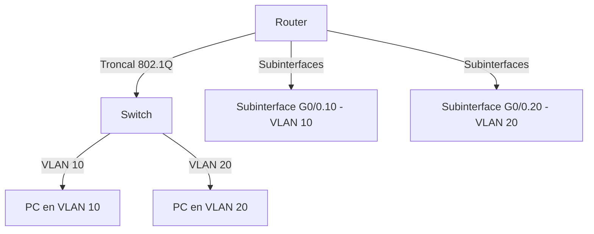

# SEMANA 4: Routing VLANs

## Conceptos Clave para Examen:

### Enrutamiento entre VLANs:
- Permite la comunicación entre dispositivos en diferentes VLANs.
- Los métodos incluyen:
  - **Router-on-a-stick:** Configura subinterfaces en una interfaz física para enrutar tráfico entre VLANs.
  - **Switch de Capa 3 con SVI:** Ofrece una solución más eficiente y escalable para grandes redes, utilizando interfaces virtuales.

### Router-on-a-stick:
- Este método usa una única interfaz física en el router con subinterfaces lógicas para enrutar el tráfico de múltiples VLANs.

## Escenario de enrutamiento entre VLANs - Router-on-a-stick:
- En este escenario, los hosts en diferentes VLANs no pueden hacer ping entre sí debido a la falta de configuración de subinterfaces y enlaces troncales.
- El enrutamiento se realiza creando subinterfaces y asignando direcciones IP correspondientes a cada VLAN.

## Diagrama en mermaid:

