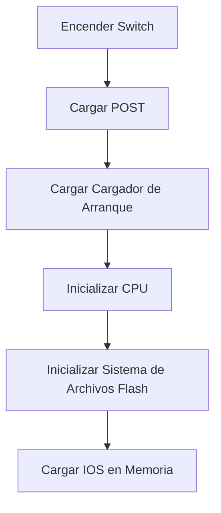
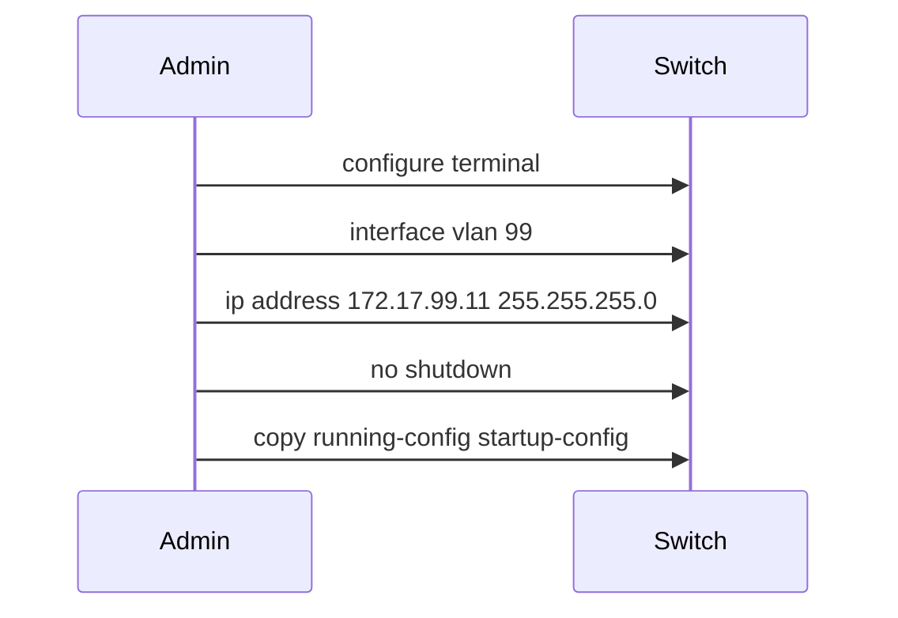
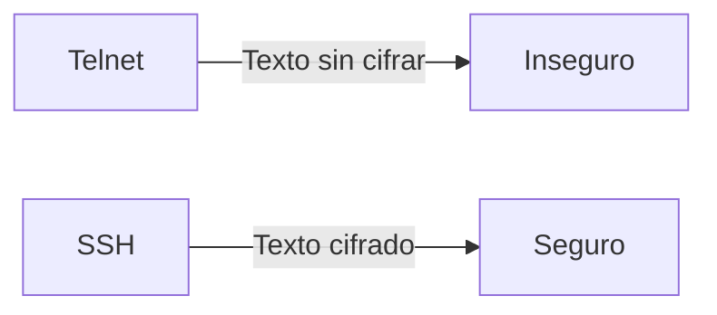
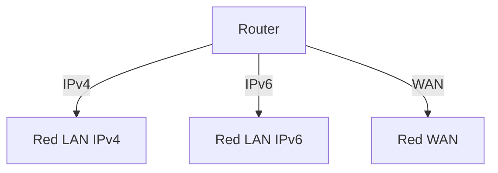

# Configuración Básica de Dispositivos de Red

## 1. Configuración Básica de un Switch

### 1.1 Parámetros Iniciales del Switch
- **Secuencia de arranque de un switch:**
  1. Carga el programa de autocomprobación (POST).
  2. Carga el software del cargador de arranque.
  3. Inicializa la CPU de bajo nivel.
  4. Inicializa el sistema de archivos flash.
  5. Carga la imagen de software del sistema operativo IOS.

- **Comando `boot system`:** Configuración del archivo de arranque del sistema operativo IOS.

### 1.2 Configuración del Acceso de Administración
- Configuración de la interfaz de administración virtual (SVI) con dirección IP y máscara de subred.
- **Ejemplo de Configuración de SVI:**

### 1.3 Configuración de Puertos de un Switch
- **Dúplex Completo vs. Semi-dúplex:**
  - Dúplex completo permite transmisión y recepción simultáneas, mientras que semi-dúplex no.
- **Auto-MDIX:** Configura automáticamente el tipo de cable requerido (directo o cruzado).

### 1.4 Comandos de Verificación de Puertos
- `show interfaces`
- `show running-config`
- `show ip interface brief`

### 1.5 Problemas Comunes de Conectividad
- Errores de CRC, colisiones tardías, errores de entrada y salida.

## 2. Acceso Remoto Seguro

### 2.1 Telnet vs SSH
- **Telnet:** Utiliza el puerto TCP 23; no es seguro.
- **SSH:** Utiliza el puerto TCP 22; ofrece conexión segura y encriptada.

### 2.2 Configuración de SSH
1. Verificar compatibilidad con SSH (`show ip ssh`).
2. Configurar el dominio IP (`ip domain-name`).
3. Generar pares de claves RSA (`crypto key generate rsa`).
4. Configurar autenticación de usuario.
5. Configurar líneas `vty` para SSH.
6. Activar la versión SSH 2 (`ip ssh version 2`).

## 3. Configuración Básica de un Router

### 3.1 Configuración Inicial del Router
- Asignar nombre al dispositivo y configurar contraseñas.
- Configurar banners de aviso legal de acceso no autorizado.
- **Guardar la configuración:** `copy running-config startup-config`.

### 3.2 Configuración de Interfaces
- **Interfaces Físicas y Lógicas (Loopback):**
  - Configuración de direcciones IP para interfaces LAN/WAN.
  - Configuración de interfaz loopback para pruebas y administración.

### 3.3 Topología Dual Stack

## 4. Verificación de Redes Conectadas Directamente

### 4.1 Comandos de Verificación de Interfaces
- `show ip interface brief`
- `show ipv6 interface brief`
- `show ip route`
- `show ipv6 route`

### 4.2 Filtrado de Resultados de Comandos
- Uso de `| include`, `| exclude`, `| section` para filtrar resultados.

## 5. Laboratorios y Ejercicios Prácticos

- **Packet Tracer:**
  - Configurar SSH, verificar conectividad de red IPv4/IPv6, y manejar tablas de direcciones MAC.
- **Laboratorio de Configuración del Router:**
  - Configurar parámetros básicos del router y verificar la conectividad de red.

## Conclusión
Este documento cubre los aspectos esenciales de la configuración básica de switches y routers, incluidos los comandos necesarios, los conceptos de administración de red y los mecanismos de acceso seguro.
